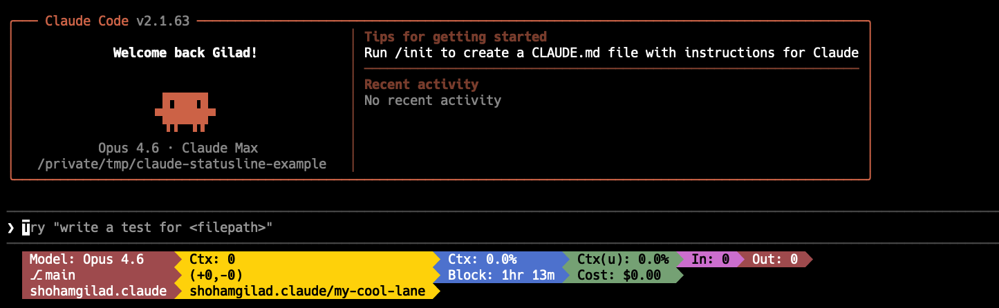

# my-claude-statusline

My custom [ccstatusline](https://github.com/sirmalloc/ccstatusline) configuration and scripts for [Bit](https://bit.dev) workspaces and Israel Oref alert monitoring.

## Example



## Setup

1. Install ccstatusline following the [installation instructions](https://github.com/sirmalloc/ccstatusline#-quick-start)
2. Clone this repo to `~/dev/my-claude-statusline`
3. Symlink the settings file:
   ```bash
   ln -sf ~/dev/my-claude-statusline/settings.json ~/.config/ccstatusline/settings.json
   ```

## Scripts

### `scripts/default-scope.sh`

Displays the Bit workspace default scope from `workspace.jsonc`.

| Scenario | Output |
|---|---|
| Bit workspace | The `defaultScope` value (e.g. `my-scope`) |
| Bit workspace without scope | `no scope` |
| Not a Bit workspace | `no bit` |

### `scripts/lane-name.sh`

Displays the current Bit lane name from `.bitmap`.

| Scenario | Output |
|---|---|
| On a lane | `scope/lane-name` (e.g. `my-org.my-scope/feature-lane`) |
| On main (no lane) | `main` |
| Not a Bit workspace | `no bit` |

### `scripts/oref-alert.sh`

Monitors Israel Home Front Command (Pikud HaOref) alerts and displays color-coded status for a configured city. Uses `preserveColors: true` for dynamic ANSI colors.

**City configuration** (script argument takes priority over env var):

```bash
# Option 1: Environment variable
export OREF_ALERT_CITY="תל אביב - מזרח"

# Option 2: Script argument in settings.json commandPath
"commandPath": "~/dev/my-claude-statusline/scripts/oref-alert.sh 'חולון'"
```

City names must exactly match the Oref API values (Hebrew, including dashes for sub-areas).

| Scenario | Output | Color |
|---|---|---|
| No active alerts | `Safe - <city>` | Green |
| Active threat for your city (cat 1) | `SHELTER NOW` | Red |
| All clear for your city (cat 10) | `All clear` | Green |
| Alert for other cities only | `Safe - <city>` | Green |
| Unknown alert category | `unknown-<cat>-<desc>-<title>` | Orange |
| No city configured | `oref: no city` | Orange |

**Testing mode** — set `OREF_TEST_MODE` to simulate scenarios without hitting the API:

| `OREF_TEST_MODE` | Simulates |
|---|---|
| `shelter` | Active rocket alert (red) |
| `clear` | All clear (green) |
| `none` | No active alerts (green) |

```bash
OREF_ALERT_CITY="תל אביב" OREF_TEST_MODE=shelter echo '{}' | bash scripts/oref-alert.sh
```

## Configuration

`settings.json` is the ccstatusline configuration file, symlinked from `~/.config/ccstatusline/settings.json`. Any changes made via the ccstatusline TUI are automatically reflected here.
